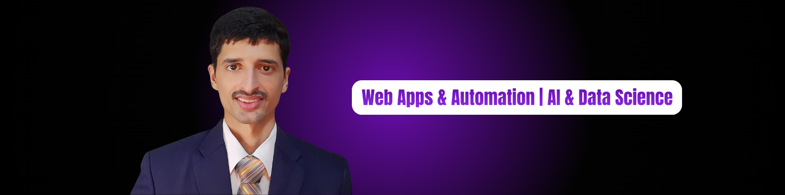

# 👋 Hi, I'm Muhammad Ali  

🚀 **Full-Stack AI Engineer | Workflow Automation Expert | Founder @Techjori**  
🎓 Bachelor of computer in Software Engineering  
💡 Passionate about AI-powered web apps, automation, data science, and analytics

---

## 🔥 What I Do:  
- 🖥 **Full-Stack AI Development** – MERN Stack,Nest.js, Next.js, Python, FastAPI, Django & more  
- 🤖 **AI Engineering & Integration** – OpenAI (GPT), LLaMA, ElevenLabs, HygenAI, and other foundation models  
- ⚡ **Workflow Automation** – Make.com, Zapier, n8n, AI Agents.  
- 📊 **Exploring Data Science & Analytics** – Continuously expanding my knowledge in data-driven technologies  

---

## 📩 Let’s Connect!  
I’m open to **full-time remote roles, freelance projects, and collaborations** in AI development, full-stack engineering, and automation. **Feel free to reach out!**  

 

&nbsp;
&nbsp;
&nbsp;
&nbsp;
&nbsp;
&nbsp;

 

