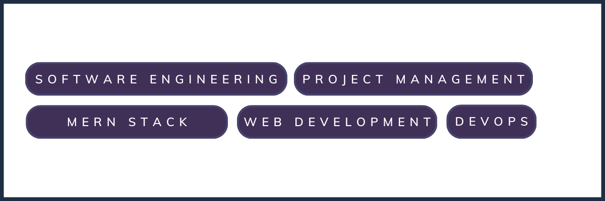

 

&nbsp;
&nbsp;
&nbsp;
&nbsp;
&nbsp;
&nbsp;
&nbsp;

 

<h2 align="center">About</h2>

I'm <b>Muhammad Ali</b>, a <b>software engineer</b>, <b>Web Developer</b>, and <b>tech enthusiast.</b>

I am an Experienced software engineer skilled in full-stack web development with expertise in MERN stack, Node.js, and React.js. Proven track record of delivering high-quality solutions, leveraging agile methodologies and collaborating with cross-functional teams.

Thanks for stopping by and happy coding!

<h2 align="center">Top Projects</h2>

<h2 align="center"> Streak Stats</h2>
 
 

 
 

<h2 align="center">Latest Tweets</h2>

  <h2 align="center">🛠️ My Favorite Tools</h2>
  <h3 align="center">👨‍💻 Programming and Markup Languages</h3>

  

      
      
      
      
      

  

  <h3 align="center">🧰 Frameworks and Libraries</h3>

  

      
      
      
      
  

  <h3 align="center">🗄️ Databases</h3>

  

      
      
  

  <h3 align="center">💻 Software and Tools</h3>

  

      
      
      
  

</div
