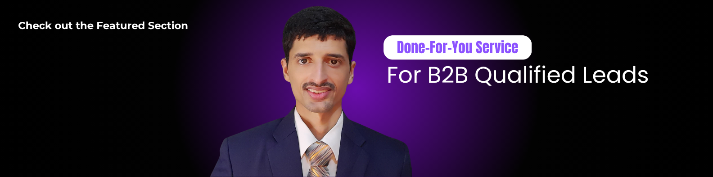

# 👋 Hi, I'm Muhammad Ali  

🚀 **Email Marketing & AI/Workflow Automation Specialist | Founder @Techjori**  
🎓 Bachelor of computer in Software Engineering  
💡 Passionate about AI, Workflow Automation, Email marketing, and B2B Lead Generation

---

## 🔥 What I Do

- 📩 **Done-for-You Cold Email Marketing** – Full outreach systems for B2B lead generation using Instantly, Apollo, custom domains, and email warmups  
- 🤖 **AI & Workflow Automation** – Automating repetitive tasks using Zapier, Make.com, n8n, and AI agents  
- 🔗 **Tech Stack Integration** – Seamlessly connecting tools like CRMs, OpenAI, Google Sheets, Notion, Slack, and more  
- 📈 **B2B Growth Systems** – Helping businesses scale with automated lead flows and smart outreach strategies  

---

## 📩 Let’s Connect!  
I’m open to **full-time remote roles, freelance projects, and collaborations** in AI Automation, Email Marketing, and B2B Lead Generation. **Feel free to reach out!**  

 

&nbsp;
&nbsp;
&nbsp;
&nbsp;
&nbsp;
&nbsp;

 

